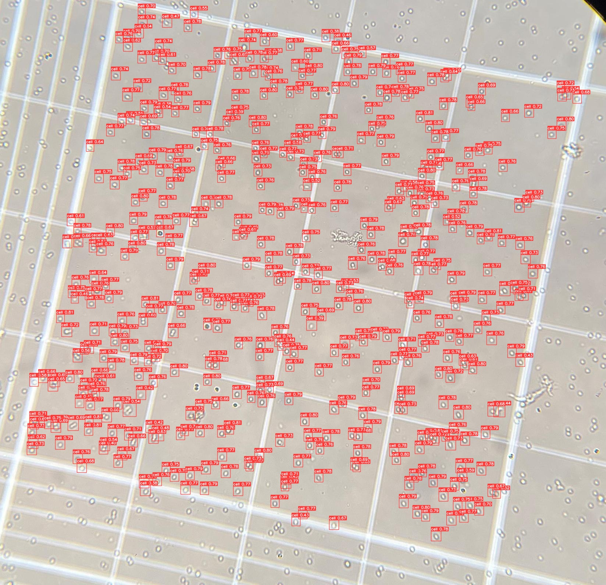

# Hemocytometer_Cell_Counting_yolov5
Automated Cell Counting from mobile camera 

##Rational
My lab needs cell counts for CyTOF and other assays. We generally use our MACSQuannt flow cytometer for cell counts. However, it sometimes breaks, or may be in use. In this case we manually count using a hemocytometer and microscope. As a fun side project, I've worked on automating this for speed, particulalry useful with many samples. 

##Function
Input picture taken from mobile device through microscope eye piece, output cell counts

##Pipline
Mobile image -> downsize to 416x416 -> yolov5 to label counting square
Mobile image -> crop counting square -> downsize 1024x1024 -> yolov5 to count cells

##Directions for improvment
  Create mobile app to eliminate transfer to desktop, would probably check [OnePetri](https://github.com/mshamash/OnePetri) first for guidance
  Currently only runs from anaconda prompt, something to do with torchvision, haven't figured out how to run in command prompt 
  Labels, could add trypan blue dead cell detection, detection of abnormal shapes, clumps, ect 
  

